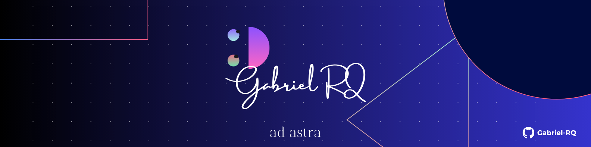

  

###

  

###

<h5 align="left">[EN]</h5>

###

<h1 align="left">Hello, I'm Gabriel...</h1>

###

Full stack developer, Computer Science undergraduate student, constantly learning and very curious about technology.

###

<h5 align="left">[PT]</h5>

###

<h1 align="left">Olá, eu sou o Gabriel...</h1>

###

Desenvolvedor Full Stack, graduando em Ciência da Computação, constantemente aprendendo e muito curioso sobre tecnologia.

###

<h1 align="left">Tech Stack 💻</h1>

###

  
  
  
  
  
  
  
  
  
  
  
  
  
  
  
  
  
  
  
  
  
  
  
  
  
  
  
  
  
  
  
  
  

###

  
  
  

###

###

  
  

###
